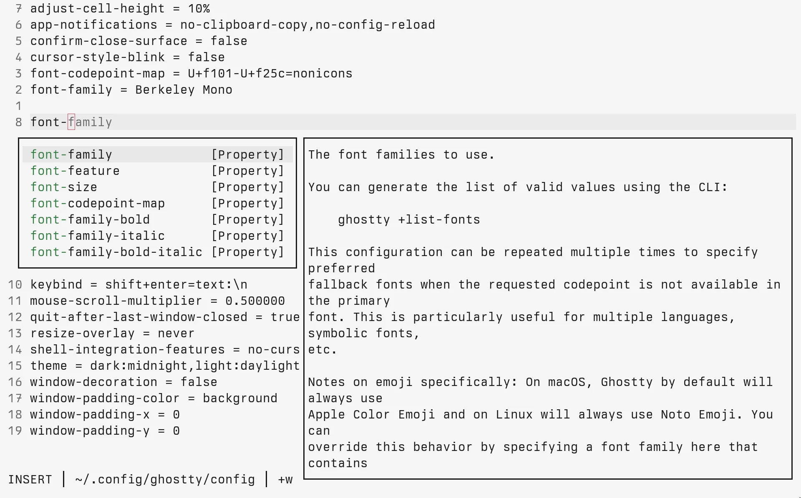

# blink-cmp-ghostty

Ghostty configuration completion source for
[blink.cmp](https://github.com/saghen/blink.cmp).

> [!NOTE]
> Active development is hosted on
> [Forgejo](https://forge.barrettruth.com/barrettruth/blink-cmp-ghostty).



## Features

- Completes Ghostty configuration keys with documentation
- Provides enum values for configuration options
- Documentation extracted from `ghostty +show-config --docs`

## Requirements

- Neovim 0.10.0+
- [blink.cmp](https://github.com/saghen/blink.cmp)
- [Ghostty](https://ghostty.org)

## Installation

With `vim.pack` (Neovim 0.12+):

```lua
vim.pack.add({
  'https://forge.barrettruth.com/barrettruth/blink-cmp-ghostty',
})
```

Configure `blink.cmp`:

```lua
require('blink.cmp').setup({
  sources = {
    default = { 'ghostty' },
    providers = {
      ghostty = {
        name = 'Ghostty',
        module = 'blink-cmp-ghostty',
      },
    },
  },
})
```
